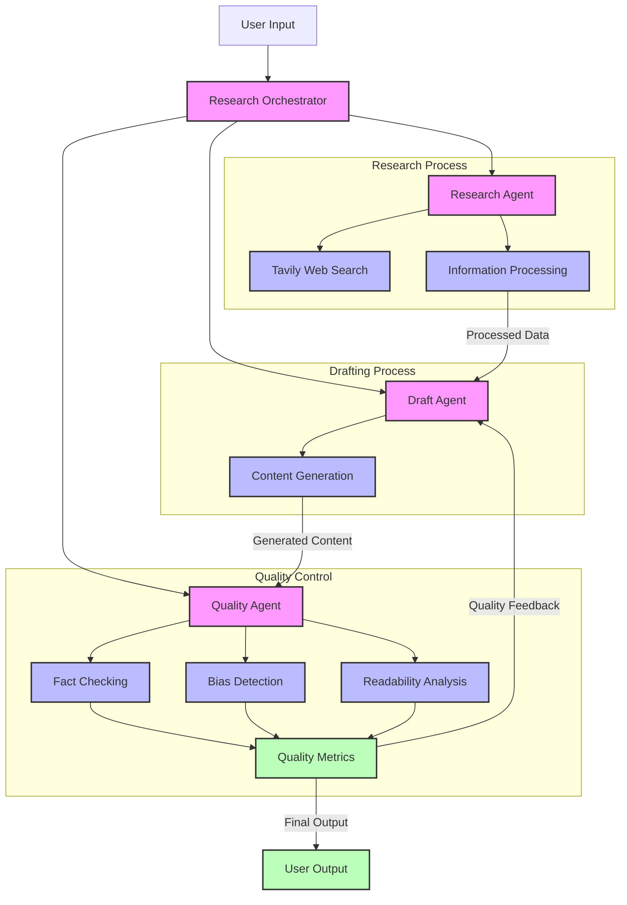

# Kairon: Advanced AI Research System

Kairon is a sophisticated AI-powered research system that combines web crawling, information synthesis, and quality assurance to deliver comprehensive and accurate research results. The system utilizes multiple specialized agents working in concert to gather, analyze, and present information effectively.

## 🌟 Features

- **Multi-Agent Architecture**: Specialized agents for research, drafting, and quality control
- **Advanced Web Research**: Powered by Tavily for comprehensive web crawling
- **Quality Assurance**: Built-in fact-checking, bias detection, and readability analysis
- **Intelligent Drafting**: Context-aware content generation with citation tracking
- **Continuous Improvement**: Iterative refinement based on quality metrics

## 🛠️ Technical Stack

- **Language Models**: Google Gemini 2.0 Flash
- **Frameworks**: LangChain, LangGraph
- **Web Research**: Tavily API
- **Language**: Python 3.12+
- **Dependency Management**: Poetry

## 📋 Prerequisites

- Python 3.12 or higher
- Poetry for dependency management
- Google API key for Gemini
- Tavily API key

## 🚀 Installation

1. Clone the repository:
```bash
git clone https://github.com/akash2704/Advanced-AI-Research-System.git
cd kairon
```

2. Install dependencies using Poetry:
```bash
poetry install --with dev
```

3. Set up environment variables:
```bash
cp .env
# Edit .env with your API keys
```
```env
# Google Gemini API Configuration
GOOGLE_API_KEY="your_gemini_api_key_here"

# Tavily API Configuration
TAVILY_API_KEY="your_tavily_api_key_here"

# Optional: Logging Configuration
LOG_LEVEL=INFO  # DEBUG, INFO, WARNING, ERROR, CRITICAL
LOG_FILE=kairon.log
```

Important Notes:
- The `.env` file should never be committed to version control
- Keep your API keys secure and never share them publicly
- The `.env.example` file is provided as a template
- Required environment variables:
  - `GOOGLE_API_KEY`: Your Google Gemini API key
  - `TAVILY_API_KEY`: Your Tavily API key
- Optional environment variables:
  - `LOG_LEVEL`: Set the logging level (default: INFO)
  - `LOG_FILE`: Specify the log file name (default: kairon.log)

## 💻 Usage

Basic usage:
```python
from kairon.orchestrator import ResearchOrchestrator

orchestrator = ResearchOrchestrator()
question = "What are the latest developments in quantum computing?"
answer, quality_check = orchestrator.run_research(question)
```

## 🏗️ System Architecture



The architecture consists of three main processes:

1. **Research Process**: Handles web crawling and information gathering
   - Research Agent coordinates the process
   - Tavily Web Search for comprehensive data collection
   - Information Processing for data cleaning and organization

2. **Drafting Process**: Creates and refines content
   - Draft Agent manages content generation
   - Content Generation with context awareness
   - Integration with research findings

3. **Quality Control**: Ensures content quality
   - Quality Agent oversees all checks
   - Fact Checking for accuracy
   - Bias Detection for neutrality
   - Readability Analysis for clarity
   - Quality Metrics for continuous improvement

The system features a feedback loop where quality metrics inform content revisions, ensuring continuous improvement of the output.

## 🔍 Quality Metrics

The system provides comprehensive quality metrics:
- Fact Accuracy Score
- Consistency Score
- Bias Detection
- Readability Score
- Issue Identification
- Improvement Suggestions

## 📊 Performance

- Average research time: 2-3 minutes per query
- Source validation accuracy: >90%
- Fact-checking confidence: >85%
- Readability optimization: Automated

## 🤝 Contributing

1. Fork the repository
2. Create your feature branch (`git checkout -b feature/AmazingFeature`)
3. Commit your changes (`git commit -m 'Add some AmazingFeature'`)
4. Push to the branch (`git push origin feature/AmazingFeature`)
5. Open a Pull Request


## 📧 Contact

For inquiries and support:
- Email: akashkallai27@gmail.com
- GitHub Issues: [Create an issue](https://github.com/akash2704/Advanced-AI-Research-System/issues)

## 🙏 Acknowledgments

- Google for Gemini API
- Tavily for web search capabilities
- LangChain and LangGraph communities
- All contributors and users of this project
