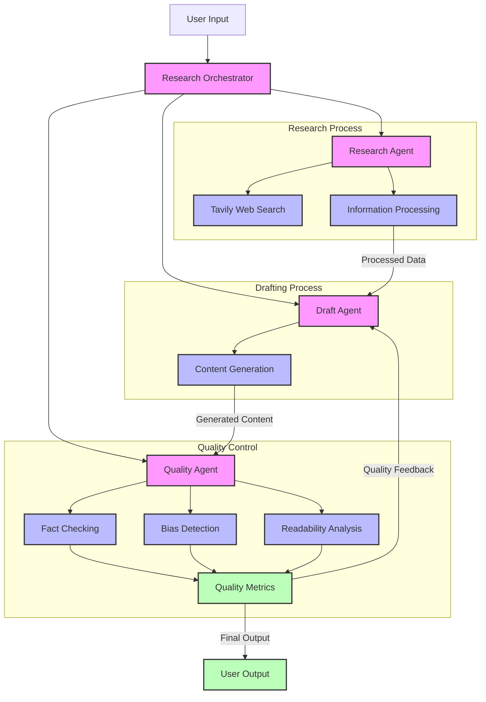

# Kairon - AI Research Assistant

Kairon is an AI-powered research assistant that helps gather, analyze, and present information on complex topics. It uses a combination of web search, language models, and quality checks to provide well-researched and accurate answers.

## Features

- **Research Agent**: Gathers and analyzes information from the web
- **Draft Agent**: Creates well-structured answers based on research
- **Quality Agent**: Ensures accuracy and quality of the content
- **Orchestrator**: Coordinates the entire research and drafting process

## Components

### Research Agent
- Uses Tavily for web search
- Employs Gemini for information analysis
- Maintains research state and iteration tracking

### Draft Agent
- Creates initial drafts from research findings
- Supports revision based on feedback
- Maintains draft state and revision history

### Quality Agent
- Evaluates content accuracy
- Checks for bias and consistency
- Provides readability scores and suggestions

### Orchestrator
- Coordinates the research workflow
- Manages state transitions
- Handles error cases and retries

## Setup

1. Clone the repository:
```bash
git clone https://github.com/yourusername/kairon.git
cd kairon
```

2. Install dependencies:
```bash
poetry install
```

3. Set up environment variables:
```bash
cp .env.example .env
```
Edit `.env` and add your API keys:
```
GOOGLE_API_KEY=your_gemini_api_key
TAVILY_API_KEY=your_tavily_api_key
```

## Testing

The project uses pytest for testing. Tests are organized by component:

### Research Agent Tests
```bash
poetry run pytest tests/test_research_agent.py -v
```

### Draft Agent Tests
```bash
poetry run pytest tests/test_draft_agent.py -v
```

### Quality Agent Tests
```bash
poetry run pytest tests/test_quality_agent.py -v
```

### System Tests
```bash
poetry run pytest tests/test_research_system.py -v
```

## Usage

1. Initialize the orchestrator:
```python
from kairon.orchestrator import ResearchOrchestrator

orchestrator = ResearchOrchestrator()
```

2. Run research:
```python
question = "What are the latest developments in quantum computing?"
answer, quality_check = orchestrator.run_research(question)
```

3. Check results:
```python
print(f"Answer: {answer}")
print(f"Quality Check: {quality_check}")
```

## Error Handling

The system includes comprehensive error handling:
- Empty or invalid questions
- API errors
- Quality check failures
- Research iteration limits

## Contributing

1. Fork the repository
2. Create a feature branch
3. Make your changes
4. Run tests
5. Submit a pull request

## License

This project is licensed under the MIT License - see the LICENSE file for details.

## 🌟 Features

- **Multi-Agent Architecture**: Specialized agents for research, drafting, and quality control
- **Advanced Web Research**: Powered by Tavily for comprehensive web crawling
- **Quality Assurance**: Built-in fact-checking, bias detection, and readability analysis
- **Intelligent Drafting**: Context-aware content generation with citation tracking
- **Continuous Improvement**: Iterative refinement based on quality metrics

## 🛠️ Technical Stack

- **Language Models**: Google Gemini 2.0 Flash
- **Frameworks**: LangChain, LangGraph
- **Web Research**: Tavily API
- **Language**: Python 3.12+
- **Dependency Management**: Poetry

## 📋 Prerequisites

- Python 3.12 or higher
- Poetry for dependency management
- Google API key for Gemini
- Tavily API key

## 🚀 Installation

1. Clone the repository:
```bash
git clone https://github.com/akash2704/Advanced-AI-Research-System.git
cd kairon
```

2. Install dependencies using Poetry:
```bash
poetry install --with dev
```

3. Set up environment variables:
```bash
cp .env
# Edit .env with your API keys
```
```env
# Google Gemini API Configuration
GOOGLE_API_KEY="your_gemini_api_key"

# Tavily API Configuration
TAVILY_API_KEY="your_tavily_api_key"

# Optional: Logging Configuration
LOG_LEVEL=INFO  # DEBUG, INFO, WARNING, ERROR, CRITICAL
LOG_FILE=kairon.log
```

Important Notes:
- The `.env` file should never be committed to version control
- Keep your API keys secure and never share them publicly
- The `.env.example` file is provided as a template
- Required environment variables:
  - `GOOGLE_API_KEY`: Your Google Gemini API key
  - `TAVILY_API_KEY`: Your Tavily API key
- Optional environment variables:
  - `LOG_LEVEL`: Set the logging level (default: INFO)
  - `LOG_FILE`: Specify the log file name (default: kairon.log)

## 💻 Usage

Basic usage:
```python
from kairon.orchestrator import ResearchOrchestrator

orchestrator = ResearchOrchestrator()
question = "What are the latest developments in quantum computing?"
answer, quality_check = orchestrator.run_research(question)
```

## 🏗️ System Architecture



The architecture consists of three main processes:

1. **Research Process**: Handles web crawling and information gathering
   - Research Agent coordinates the process
   - Tavily Web Search for comprehensive data collection
   - Information Processing for data cleaning and organization

2. **Drafting Process**: Creates and refines content
   - Draft Agent manages content generation
   - Content Generation with context awareness
   - Integration with research findings

3. **Quality Control**: Ensures content quality
   - Quality Agent oversees all checks
   - Fact Checking for accuracy
   - Bias Detection for neutrality
   - Readability Analysis for clarity
   - Quality Metrics for continuous improvement

The system features a feedback loop where quality metrics inform content revisions, ensuring continuous improvement of the output.

## 🔍 Quality Metrics

The system provides comprehensive quality metrics:
- Fact Accuracy Score
- Consistency Score
- Bias Detection
- Readability Score
- Issue Identification
- Improvement Suggestions

## 📊 Performance

- Average research time: 2-3 minutes per query
- Source validation accuracy: >90%
- Fact-checking confidence: >85%
- Readability optimization: Automated

## 🤝 Contributing

1. Fork the repository
2. Create your feature branch (`git checkout -b feature/AmazingFeature`)
3. Commit your changes (`git commit -m 'Add some AmazingFeature'`)
4. Push to the branch (`git push origin feature/AmazingFeature`)
5. Open a Pull Request


## Testing

The project uses pytest for testing. Tests are located in the `tests` directory and cover different components of the system.

### Running Tests

```bash
# Run all tests
poetry run pytest

# Run specific test file
poetry run pytest tests/test_draft_agent.py

# Run with verbose output
poetry run pytest -v
```

### Test Structure

#### 1. Draft Agent Tests (`tests/test_draft_agent.py`)

Tests for the `DraftAgent` class which handles content generation and revision:

- `test_draft_agent_initialization`: Verifies proper initialization of the DraftAgent
- `test_draft_agent_draft_answer`: Tests the initial draft creation from research
- `test_draft_agent_revise_answer`: Tests the revision process with feedback
- `test_draft_agent_with_empty_research`: Ensures proper error handling for empty research
- `test_draft_agent_with_invalid_feedback`: Validates feedback validation
- `test_draft_state_validation`: Checks DraftState model validation
- `test_draft_state_revision_count`: Verifies revision count tracking
- `test_draft_agent_error_handling`: Tests error handling in the draft process

#### 2. Quality Agent Tests (`tests/test_quality_agent.py`)

Tests for the `QualityAgent` class which handles content quality assessment:

- `test_quality_agent_initialization`: Verifies proper initialization of the QualityAgent
- `test_quality_agent_check_content`: Tests the quality checking process
- `test_quality_check_validation`: Validates QualityCheck model constraints
- `test_quality_agent_with_empty_content`: Tests empty content handling
- `test_quality_agent_with_empty_sources`: Tests empty sources handling
- `test_quality_agent_error_handling`: Tests error handling in quality checks
- `test_quality_check_with_bias`: Tests bias detection functionality
- `test_quality_check_with_low_scores`: Tests scoring system for low-quality content

#### 3. Research Agent Tests (`tests/test_research_agent.py`)

Tests for the `ResearchAgent` class which handles information gathering:

- `test_research_agent_initialization`: Verifies proper initialization
- `test_research_agent_research`: Tests the research process
- `test_research_agent_with_empty_question`: Tests empty question handling
- `test_research_agent_with_invalid_question`: Tests invalid question handling
- `test_research_agent_error_handling`: Tests error handling in research

### Test Fixtures

The project uses pytest fixtures defined in `tests/conftest.py`:

- `mock_gemini_llm`: Mocks the Gemini API for testing
- `research_state`: Creates a test research state
- `draft_state`: Creates a test draft state
- `quality_check`: Creates a test quality check
- `draft_agent`: Creates a DraftAgent instance with mocked dependencies
- `quality_agent`: Creates a QualityAgent instance with mocked dependencies

### Mocking Strategy

The tests use mocking to avoid actual API calls:

1. Gemini API is mocked using `unittest.mock.MagicMock`
2. API responses are simulated with predefined content
3. Error conditions are tested using `side_effect`

### Test Coverage

To check test coverage:

```bash
# Install coverage package
poetry add --dev pytest-cov

# Run tests with coverage
poetry run pytest --cov=kairon tests/
```

### Continuous Integration

Tests are automatically run on:
- Pull requests
- Push to main branch
- Scheduled runs

### Best Practices

1. Each test should be independent
2. Use descriptive test names
3. Test both success and failure cases
4. Mock external dependencies
5. Keep tests focused and simple
6. Update tests when adding new features
7. Document test requirements in docstrings

## 📧 Contact

For inquiries and support:
- Email: akashkallai27@gmail.com
- GitHub Issues: [Create an issue](https://github.com/akash2704/Advanced-AI-Research-System/issues)

## 🙏 Acknowledgments

- Google for Gemini API
- Tavily for web search capabilities
- LangChain and LangGraph communities
- All contributors and users of this project